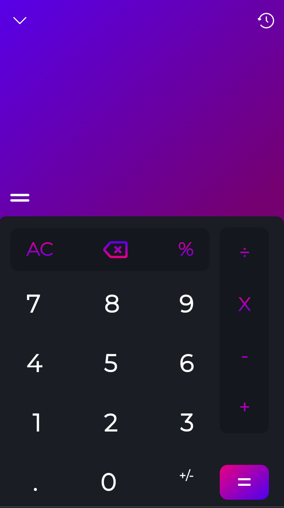
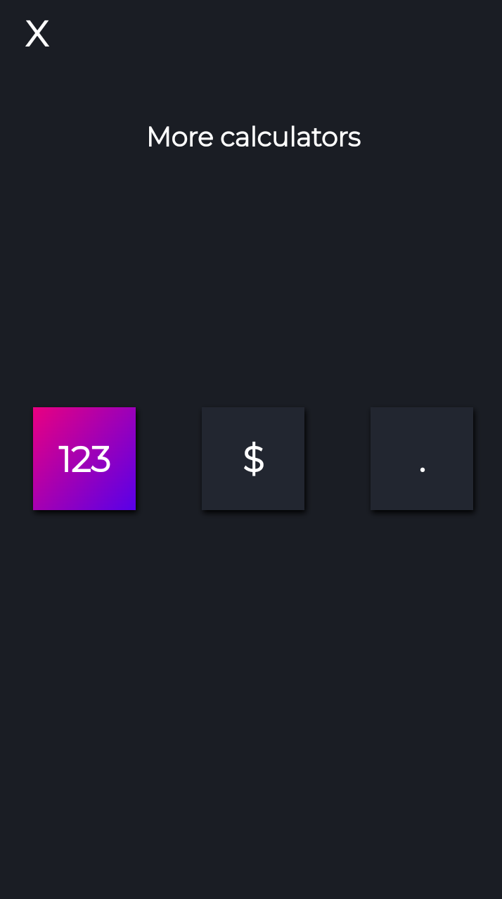
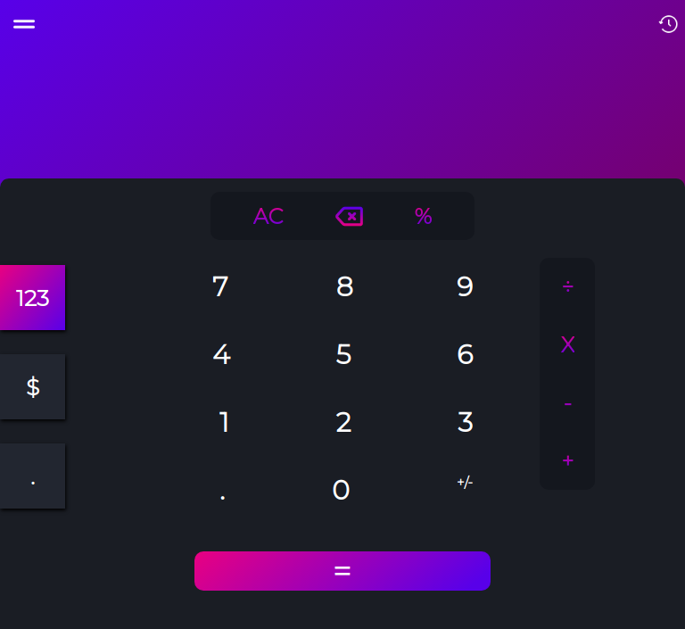
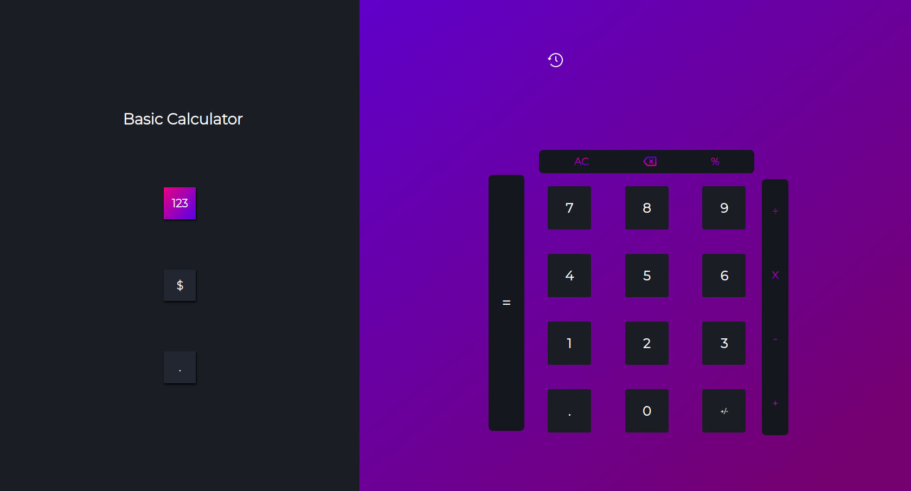

<h1 align="center">√ Calculator</h1>

<p align="center">A website that emulates a calculator!</p>

<br/>
<br/>

<p align="center">
 <a href="#objective">Objectives</a> • 
 <a href="#installation">Installation</a> • 
 <a href="#tecnologies">Tecnologies</a> • 
 <a href="dependencies">Dependencies</a> • 
 <a href="printscreens">Printscreens</a> • 
 <a href="#contributions">Contribution</a> •  
 <a href="#author">Author</a>
</p>

<br/><br/><br/>

<h1>Status: 
🚧 Under construction.
🚧 </h1
 
 
<br/><br/>
 
<h1 id="objective">🎯 Objectives</h1>
 
<p>Train my knowledge in javascript css and html as well as train my knowledge in responsiveness, mobile first, ui/ux desing, all based on the project developed in figma:https://www.figma.com/file/f8TyTQsOo1HDj9yx8czu8Q/Calculator
<br/><br/>
 
<h1 id="installation">⚙️ Installation</h1>
 
<h3>Windows:</h3>


```cmd
# Clone this repository
git clone <https://github.com/WilsonJunior1/Calculator.git>

# Go to the project's folder
cd Calculator

# Open the index.html in your favorite browser
```


  
<h3>Linux:<h3>
 
 
```bash
# Clone this repository
git clone <https://github.com/WilsonJunior1/Calculator.git>

# Go to the project's folder
cd Calculator

# Open the index.html in your favorite browser
```
  
<h3>MacOS</h3>


```bash
# Clone this repository
git clone <https://github.com/WilsonJunior1/Calculator.git>

# Go to the project's folder
cd Calculator

# Open the index.html in your favorite browser
```
 
<br/><br/>
 
 
<h1 id="tecnologies">💻 Tecnologies</h1>
 
<ul>
 <li>HTML5</li>
 <li>CSS3</li>
 <li>JAVASCRIPT</li>
 <li>Figma</l1>
</ul>

<br/><br/>

<h1 id="dependencies">⚠️ Dependencies</h1>

 <ol>
 <li>A web browser</li>
 <li>git(To clone this repository)</li>
 </ol>
 
<br/><br/>
 
<h1 id="printscreen">📷 Printscreen</h1>

<h3>Mobile</h3>


<h3>Tablets</h3>

<h3>Desktop</h3>


<br/><br/>
 
<h1 id="contributions">👥 Contribution</h1>

<p>You can tell me about issues in the project! Or add new funtionalities and make a pull request!</p>

<br/><br/>


<h1 id="author" align="center">Author</h1>

<p align="center">Wilson Júnior</h1>
